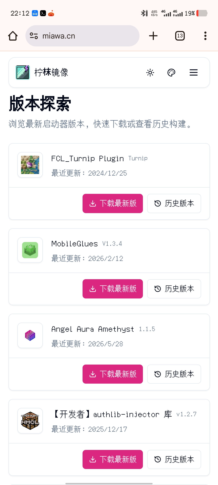

# 柠枺镜像

[](https://github.com/leemwood/lemwood-mirror/actions)
[](https://go.dev/)
[](LICENSE)

面向 Minecraft 启动器分发场景的 GitHub Release / Git 仓库镜像服务 — 自动同步、版本管理、下载加速、统计风控，开箱即用。



## 目录

- [快速开始](#快速开始)
- [功能](#功能)
- [安装与构建](#安装与构建)
- [配置说明](#配置说明)
- [下载流程](#下载流程)
- [统计与风控](#统计与风控)
- [部署](#部署)
- [API](#api)
- [目录结构](#目录结构)
- [参与贡献](#参与贡献)
- [许可](#许可)

## 快速开始

```bash
# 1. 构建前端
cd web && pnpm install && pnpm build
cd ../admin-app && pnpm install && pnpm build

# 2. 构建并运行
go build -o mirror ./cmd/mirror
./mirror
```

打开 `http://localhost:8080`，看到启动器版本列表即运行成功。

> **前置依赖：** Go 1.21+、Node.js 18+、Git 2.x（启用 `clone` / `all` 模式时必需）

## 功能

- **定时同步** — 按 Cron 表达式定时扫描上游 GitHub 仓库，按模式自动同步 Release 资产和/或 Git 仓库镜像
- **版本保留** — 每个启动器可独立配置保留版本数，自动清理旧版本
- **下载加速** — 支持 xget 代理、HTTP 代理、自定义 CDN 前缀，加速国内下载
- **验证码保护** — 可选极验 GeeTest 人机验证，防止滥用
- **统计面板** — 访问量、下载量、Repo 拉取量、热门资源、地区分布、每日趋势
- **流量控制** — 单 IP 每日流量上限，超限自动封禁
- **黑名单** — 本地 + 外部黑名单同步，公开封禁记录
- **后台管理** — Web 管理面板，支持配置、黑名单、文件管理、TOTP 两步验证
- **多启动器** — 一个实例托管多个启动器的镜像，各自独立配置

## 安装与构建

### 前端

```bash
cd web && pnpm install && pnpm build
cd ../admin-app && pnpm install && pnpm build
```

### 后端

```bash
go build -o mirror ./cmd/mirror
```

Windows 下生成 `mirror.exe`。CI 自动构建 Windows/Linux 的 amd64/arm64/x86 包。

### 直接运行（开发）

```bash
go run ./cmd/mirror
```

启动时二进制会自动释放内嵌的用户前端（`web/default`）和后台前端（`web/admin`）到项目目录。每次启动都会重新释放，内容未变化的文件会跳过写入以减少 IO，确保二进制内嵌的前端版本总是即时生效。

## 配置说明

运行前编辑根目录 `config.yaml`，以下为示例配置项：

> **旧版升级**：若从 5月及之前的版本升级（使用 `config.json`），服务启动时会自动迁移至 `config.yaml` 并删除旧文件，同时补全新增字段（`launcher.mode`、`self_update_*` 等）的默认值。升级后若发现项目根目录有遗留的 `web/default_v2/` 目录（6月前的双主题构建产物），也会自动清理。

```yaml
server_address: ""
server_port: 8080
check_cron: "*/10 * * * *"
storage_path: "download"
github_token: ""
download_url_base: "https://mirror.example.com"
download_timeout_minutes: 40
concurrent_downloads: 3
proxy_url: ""
asset_proxy_url: ""
xget_domain: "https://xget.xi-xu.me"
xget_enabled: true
admin_enabled: true
admin_user: "admin"
admin_password: "<bcrypt-hash>"
admin_max_retries: 10
admin_lock_duration: 120
two_factor_enabled: false
two_factor_secret: ""
captcha_enabled: false
captcha_app_id: ""
captcha_secret_key: ""
traffic_limit_gb: 0
ban_record_file: "banned_ips.txt"
external_blacklist_url: ""
appeal_contact: "QQ群 https://qm.qq.com/q/FOGt99aayY"
mysql_host: ""
mysql_port: 3306
mysql_user: ""
mysql_password: ""
mysql_database: ""
mysql_migration: false
launchers:
  - name: "fcl"
    source_url: "https://github.com/FCL-Team/FoldCraftLauncher"
    repo_selector: ""
    mode: "all"
    include_prerelease: false
    max_versions: 2
```

### 服务与网络

| 字段 | 类型 | 默认值 | 说明 |
|------|------|--------|------|
| `server_address` | string | `""` | 绑定地址，留空监听所有网卡。**同时作为下载链接 fallback** |
| `server_port` | int | — | 服务端口 |
| `download_url_base` | string | `""` | 对外下载链接基准地址（含协议头），如 `"https://dl.mysite.com"`。为空时回退到 `server_address` |
| `proxy_url` | string | `""` | HTTP 代理，用于扫描阶段下载 |
| `asset_proxy_url` | string | `""` | 资源下载地址前缀代理 |
| `xget_enabled` | bool | — | 启用 xget 代理加速 |
| `xget_domain` | string | — | xget 服务域名 |

### GitHub 与扫描

| 字段 | 类型 | 默认值 | 说明 |
|------|------|--------|------|
| `github_token` | string | `""` | GitHub Token（**强烈建议填写**，否则每小时仅 60 次 API 调用）。支持 `GITHUB_TOKEN` 环境变量覆盖 |
| `check_cron` | string | `"*/10 * * * *"` | 扫描 Cron 表达式（分钟粒度） |
| `download_timeout_minutes` | int | — | 单文件下载超时（分钟），也作为 Git 镜像同步超时 |
| `concurrent_downloads` | int | `3` | 并发下载数 |

### 管理员

| 字段 | 类型 | 默认值 | 说明 |
|------|------|--------|------|
| `admin_enabled` | bool | — | 启用后台管理 |
| `admin_user` | string | — | 管理员用户名，为空时自动禁用管理后台 |
| `admin_password` | string | — | bcrypt 哈希密码，生成方式：`htpasswd -bnBC 14 "" <password> \| tr -d ':\n'` |
| `admin_max_retries` | int | `10` | 登录失败上限，超限 IP 锁定 |
| `admin_lock_duration` | int | `120` | IP 锁定时间（分钟） |
| `two_factor_enabled` | bool | — | 启用 TOTP 两步验证 |
| `two_factor_secret` | string | — | TOTP 共享密钥 |

### 验证码

| 字段 | 类型 | 说明 |
|------|------|------|
| `captcha_enabled` | bool | 启用下载验证码（极验 GeeTest） |
| `captcha_app_id` | string | 极验 App ID |
| `captcha_secret_key` | string | 极验 Secret Key |

### 流量控制与封禁

| 字段 | 类型 | 默认值 | 说明 |
|------|------|--------|------|
| `traffic_limit_gb` | int | — | 单 IP 每日下载流量上限（GB），`0` 禁用，负数自动修正为 `5` |
| `ban_record_file` | string | `"banned_ips.txt"` | 封禁记录文件（存于 `storage_path` 下） |
| `external_blacklist_url` | string | `""` | 外部黑名单同步地址（按行解析，跳过 `#` 注释） |
| `appeal_contact` | string | — | 封禁页显示的申诉联系方式 |

### 数据库（可选 MySQL）

| 字段 | 类型 | 默认值 | 说明 |
|------|------|--------|------|
| `mysql_host` | string | `""` | MySQL 主机，**留空使用 SQLite** |
| `mysql_port` | int | `3306` | MySQL 端口 |
| `mysql_user` | string | `""` | MySQL 用户名 |
| `mysql_password` | string | `""` | MySQL 密码 |
| `mysql_database` | string | `""` | MySQL 数据库名 |
| `mysql_migration` | bool | `false` | 启用 MySQL 迁移模式 |

### 启动器配置

| 字段 | 类型 | 默认值 | 说明 |
|------|------|--------|------|
| `name` | string | — | 启动器唯一标识，用于 API 路径、目录名和 Git 镜像名 |
| `source_url` | string | — | GitHub 仓库地址或包含仓库链接的网页 |
| `repo_selector` | string | `""` | 页面仓库链接提取规则：留空匹配第一个 GitHub 链接；`"regex:..."` 正则匹配；其他作 CSS 选择器 |
| `mode` | string | `"release"` | 同步模式：`release` 仅同步 Release，`clone` 仅同步 Git 仓库，`all` 同步两者 |
| `include_prerelease` | bool | `false` | 包含预发布版本 |
| `max_versions` | int | `0` (=3) | 保留最大版本数，≤0 时自动修正为 3；仅对 `release` / `all` 模式生效 |

### Git 仓库克隆

当某个 launcher 的 `mode` 为 `clone` 或 `all` 时，服务会在项目根目录生成 `repo/{launcher}.git` 镜像仓库，并暴露只读 HTTP 克隆地址：

```bash
git clone https://mirror.example.com/repo/fcl.git
```

- Git 镜像不占用 `storage_path`，固定存放在项目根目录 `repo/`。
- `clone` 模式不依赖 Release 存在；只要 `source_url` 能解析到 GitHub 仓库即可。
- `/repo/...` 使用与 `/download/...` 类似的受控只读入口，但采用**独立的 repo 流量计量与 repo 拉取统计**。
- repo 流量写入 `repo_ip_daily_traffic`，repo 拉取记录写入 `repo_downloads`，不会与普通下载统计混算。
- `/repo/...` 不走下载验证码与下载令牌，适用于标准 `git clone` / `git fetch`。

## 下载流程

### 验证码关闭

1. `POST /api/v2/downloads/prepare` → 获取 `download_token`、`download_url`、`landing_url`
2. 进入引导页 → `GET /api/v2/downloads/landing?token=...`
3. 触发真实下载 `/download/...`

### 验证码开启

1. `GET /api/v2/captcha/config` → 获取验证码配置
2. 用户完成验证 → `POST /api/v2/downloads/verify`
3. 获取 token → 同上流程

### 细节说明

- `download_token` 为 64 字符十六进制随机串，有效期 5 分钟
- `landing` 接口 Peek 模式（可多次调用），实际下载 Validate 模式（一次性消费）
- `landing_url` 支持 `return_url` 参数，实现下载后回跳
- 非浏览器请求在验证码开启时返回 JSON 错误而非 HTML 验证页面

## 统计与风控

### 数据统计

- 访问记录：IP、路径、UA、Referer、地区（IP 地理位置库）
- 下载记录：启动器、版本、文件名、来源 IP（仅 200/206 计入）
- 聚合接口：总访问/下载量、近 30 天数据、Top 10 热门、Top 50 地区、每日趋势
- 异步写入（4 worker + 1000 缓冲队列），不阻塞请求
- 统计接口缓存：`Cache-Control: public, max-age=300`

### 流量限制

- 单 IP 每日下载流量上限（GB 级）
- 下载前按 `Range` 头预估做预检，超限直接拒绝
- 下载完成后按实际传输字节数精确记录
- 超限自动封禁，写入本地黑名单和封禁记录

## 部署

生产环境建议 Nginx 反代 + HTTPS：

```nginx
server {
    listen 443 ssl;
    server_name mirror.example.com;

    location / {
        proxy_pass http://127.0.0.1:8080;
        proxy_set_header Host $host;
        proxy_set_header X-Real-IP $remote_addr;
        proxy_set_header X-Forwarded-For $proxy_add_x_forwarded_for;
        proxy_set_header X-Forwarded-Proto $scheme;
    }
}
```

### 健康检查

- 首页 → 确认启动器版本列表正常展示
- `/api/v2/launchers` → 确认返回版本索引
- `/api/v2/latest` → 确认返回各启动器最新版本号
- `/api/v2/stats` → 确认统计接口正常
- 执行一次实际下载 → 确认链路可用

## API

| 接口 | 方法 | 说明 |
|------|------|------|
| `/api/v2/launchers` | GET | 版本索引 |
| `/api/v2/latest/{launcher}` | GET | 启动器最新版本号 |
| `/api/v2/stats` | GET | 统计数据 |
| `/api/v2/downloads/prepare` | POST | 准备下载（验证码关闭时） |
| `/api/v2/downloads/verify` | POST | 验证码校验（验证码开启时） |
| `/api/v2/downloads/landing` | GET | 下载引导页 |
| `/api/v2/captcha/config` | GET | 验证码配置 |
| `/api/v2/admin/scans` | POST | 手动触发全量扫描（需 Admin 登录） |
| `/api/v2/admin/scans/launcher` | POST | 手动触发指定启动器扫描（需 Admin 登录） |

> 完整文档见 [`API_DOCS.md`](API_DOCS.md)，管理后台 API 不在公开文档范围内。

## 目录结构

```
lemwood-mirror/
├── cmd/mirror/          # 程序入口
├── internal/
│   ├── auth/            # 管理员认证与 TOTP
│   ├── blacklist/       # 黑名单同步
│   ├── browser/         # 网页仓库链接解析
│   ├── captcha/         # 极验验证码集成
│   ├── config/          # 配置加载与保存
│   ├── db/              # 数据库抽象（SQLite/MySQL）
│   ├── download_token/  # 下载令牌管理
│   ├── downloader/      # 版本索引生成与资产下载
│   ├── github/          # GitHub API 封装
│   ├── netutil/         # 客户端 IP 解析
│   ├── server/          # HTTP 路由、SPA 托管
│   ├── stats/           # 访问与下载统计
│   └── traffic/         # 流量限制
├── web/                 # 用户站点前端（运行时可由二进制自动释放）
├── admin-app/           # 后台管理前端源码
├── download/            # Release 镜像文件存储（默认）
├── config.yaml          # 配置文件（YAML，带注释）
└── API_DOCS.md          # 公共 API 文档
```

## 参与贡献

欢迎提交 Issue 和 Pull Request。重大问题请先开 Issue 讨论方案。

## 许可

[MIT](LICENSE) © 2025 柠枺
